<div align="center">

# ⚡ `johnsikder312-spec` // SYSTEM MATRIX ⚡

```bash
> Initializing Antigravity Node... [LOADED]
> Fetching autonomous multi-agent telemetry... [ONLINE]
> Loading system profile: Full-Stack Engineer & AI Systems Architect
```

<p align="center">
  <a href="https://github.com/johnsikder312-spec">
    
  </a>
  <a href="https://github.com/johnsikder312-spec">
    
  </a>
  <a href="https://github.com/johnsikder312-spec">
    
  </a>
</p>

<!-- 1. Centered Live GitHub Contribution Heatmap -->
<p align="center">
  
</p>

<!-- 2. Side-by-Side: Monochrome ASCII Portrait & Neofetch Terminal Info Card -->
<table align="center" width="100%" border="0" cellpadding="0" cellspacing="10">
  <tr>
    <td width="45%" valign="top" align="center">
      
    </td>
    <td width="55%" valign="top" align="center">
      
    </td>
  </tr>
</table>

</div>

---

### 🚀 Architecture & Core Focus

```yaml
specializations:
  agentic_ai:
    - Multi-agent orchestration and reactive workflow systems
    - Tool-use protocols, structured generation, and LLM telemetry
    - Real-time streaming applications with bidirectional WebSockets
  distributed_systems:
    - High-throughput asynchronous backend services (Python, Go, FastAPI, Rust)
    - Zero-downtime microservice architecture and container clustering
    - Cloud infrastructure automation on GCP and AWS
  modern_web:
    - Sub-millisecond reactive frontends with Next.js, React, and TypeScript
    - Resilient state machines, real-time data visualizers, and headless UIs
```

---

### 🛠️ Tech Radar & Engineering Stack

<div align="center">

| Domain | Technologies |
| :--- | :--- |
| **Languages** | `Python` • `TypeScript` • `Go` • `Rust` • `C++` • `SQL` • `Bash` |
| **Frameworks & Runtimes** | `React` • `Next.js` • `FastAPI` • `Node.js` • `AsyncIO` • `TailwindCSS` |
| **Cloud & DevOps** | `Google Cloud Platform` • `AWS` • `Docker` • `Kubernetes` • `GitHub Actions` • `Terraform` |
| **Data & Storage** | `PostgreSQL` • `Redis` • `BigQuery` • `SQLite` • `Vector DBs` |
| **Tools & Paradigms** | `Antigravity` • `Neovim` • `Git` • `Linux` • `Distributed Tracing` • `CI/CD` |

</div>

---

### ⚙️ How This Profile Works (Self-Contained & Zero External Services)

```
┌─────────────────────────┐     ┌────────────────────────┐     ┌────────────────────────┐
│  GitHub Contributions   │ ──> │ Python Scraper & Parser│ ──> │  Animated SVG Heatmap  │
│  (Public Profile Data)  │     │ (scripts/fetch_*.py)   │     │ (assets/heatmap.svg)   │
└─────────────────────────┘     └────────────────────────┘     └────────────────────────┘
                                                                           │
┌─────────────────────────┐     ┌────────────────────────┐                 ▼
│  Local Profile Avatar   │ ──> │ Image Preprocessor     │ ──> ┌────────────────────────┐
│  (assets/avatar.png)    │     │ & ASCII Vectorizer     │     │ Animated ASCII SVG     │
└─────────────────────────┘     └────────────────────────┘     │ (assets/ascii_art.svg) │
                                                               └────────────────────────┘
                                                                           │
┌─────────────────────────┐     ┌────────────────────────┐                 ▼
│  Profile Config         │ ──> │ Neofetch Info Card     │ ──> ┌────────────────────────┐
│  (data/profile_data.json│     │ SVG Generator          │     │ Animated Neofetch SVG  │
└─────────────────────────┘     └────────────────────────┘     │ (assets/neofetch.svg)  │
                                                               └────────────────────────┘
                                                                           │
                                                                           ▼
                                                               ┌────────────────────────┐
                                                               │  GitHub Actions Cron   │
                                                               │  Daily Auto-Commit     │
                                                               └────────────────────────┘
```

- **100% Native SVG Animations**: All typewriter reveals, staggered row fades, and pulse animations use embedded SVG CSS `@keyframes`. They render flawlessly inside GitHub's sanitized markdown environment without JavaScript or external iframes.
- **Zero Third-Party Dependency**: No reliance on third-party stats widgets or rate-limited external APIs. Contribution stats are scraped directly from public profile data and baked into self-hosted SVGs.
- **Automated Daily Sync**: A scheduled [GitHub Actions workflow](.github/workflows/update-profile-art.yml) triggers every 24 hours to refresh contributions, recalculate streaks, and push updated vector assets automatically.

---

### 📬 Connect & Collaborate

<div align="center">

[](https://github.com/johnsikder312-spec)
[](mailto:contact@johnsikder.dev)
[](https://github.com/johnsikder312-spec?tab=followers)

<br/>

<sub>⚡ Crafted with custom vector art & automated pipelines for <strong>johnsikder312-spec</strong> ⚡</sub>

</div>
